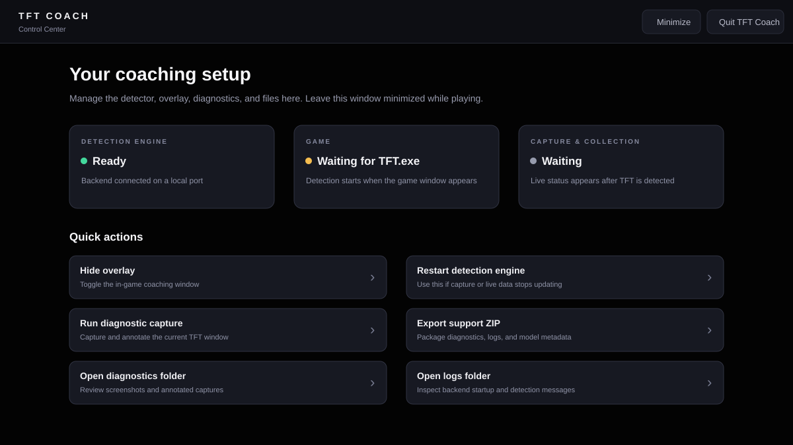
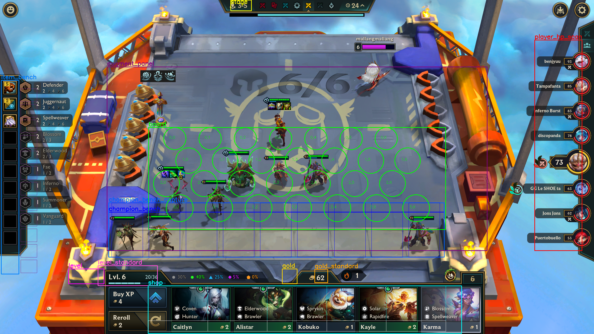
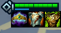
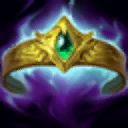
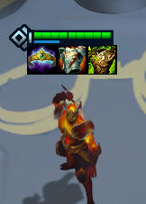
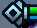

# TFT Coach

TFT Coach is a Windows desktop companion for Teamfight Tactics. It captures the
`TFT.exe` window, reads the live board with computer vision, and displays comp,
item, economy, augment, and positioning guidance in a transparent Electron
overlay. A separate Control Center handles diagnostics and support tasks without
requiring terminal commands during a game.

> **Windows beta:** a self-contained x64 installer can now be built locally.
> Python, Tesseract, and models are bundled. The first build is unsigned and
> has not yet completed clean-machine install/upgrade/uninstall testing.

## Install the Windows app

If you have a tester build, open **TFT Coach Setup 0.1.0-beta.1.exe**, choose an
installation folder, and follow the wizard. Launch **TFT Coach** from the
desktop or Start menu. The Control Center starts detection automatically;
open TFT and enter a game when ready. No Python, Node.js, Tesseract installation,
terminal command, or virtual environment is required on the player's computer.

The locally built installer is in `dist-electron/`. It is not automatically
published to GitHub; ask the maintainer for the build or follow the
[Windows build guide](docs/WINDOWS_BUILD.md). An unsigned beta may trigger
Windows publisher warnings. Signed distribution and clean-machine validation
remain release tasks.

## What it does

- Identifies live Set 18 champions with a local EfficientNet ONNX model.
- Reads active traits from the left-side TFT panel instead of guessing them
  from imperfect champion predictions.
- Detects each equipped item independently from Riot icon artwork—no model or
  item-combination training is required.
- Tracks the shop, purchases, gold, level, health, augments, and board strength.
- Scores comp directions with items weighted more heavily than temporary units.
- Runs locally; gameplay frames are not uploaded by the application.
- Provides one-click diagnostic captures and privacy-scoped support ZIPs.

## Screenshots



The Control Center starts with the desktop app. It reports backend, game, and
capture status and provides the common recovery and support actions.

<details>
<summary><strong>Live Set 18 diagnostic example</strong></summary>



The diagnostic overlays the board hexes and every screen region used by the
detector. It is intended for calibration and troubleshooting, not normal play.

This September 6 frame shows **level 6, 62 gold, and 73 HP**. The active traits
are **Defender 2, Juggernaut 2, and Spellweaver 2**. Elderwood is only **2/3**
and should not appear as active. These are expected readings from this example,
not an accuracy claim for every frame.

</details>

### Equipped-item recognition example

Each visible slot is matched separately. The detector can therefore recognize
one, two, or three items without learning the full combination.



**Actual collected crop:** left to right, Shen has **Crownguard → Gargoyle
Stoneplate → Warmog's Armor**. The image is enlarged for readability. After
the item-alias fix, replaying the nearby diagnostic returns all three names.

| Riot artwork | Example detected name |
|---|---|
|  | Crownguard |
|  | Gargoyle Stoneplate |
|  | Warmog's Armor |

Matching requires both sufficient confidence and a lead over other item
identities. Punctuation aliases such as `Warmogs Armor` and `Warmog's Armor`
are treated as one item; radiant versions remain separate. Small, clipped,
or obscured icons can still be missed. Local evaluation results do not guarantee
the same accuracy in live games.

### Three views of the same champion

These saved crops share the same capture filename. Each serves a different
task; the small detail images are enlarged here so their boundaries are visible.

| Champion identity | Star level | Equipped items |
|---|---|---|
|  |  |  |
| Label **Shen** in the champion sorter. | Label **1**, **2**, or **3** after checking the badge and full-unit context. | Review the three visible item names independently. |

Use `python scripts/sort_training_inbox.py` for champion crops,
`npm run sort:stars` for badges, and `npm run sort:items` for equipped-item
review. The [data and training instructions](#star-level-data-and-equipped-item-detection)
explain where each set of files is stored.

### Example synergy bug report

The full diagnostic above was used to reproduce a real count-reading error:

| Left panel | Incorrect app reading | Expected result |
|---|---|---|
| Elderwood **2/3** | Elderwood **5**, active | Count **2**, inactive |
| Defender **2**, with breakpoints 2 → 4 → 6 | — | Count **2**, active |

An active trait's overlay fraction can show its **next** breakpoint: Defender
**2/4** means two units with the two-unit tier already active, progressing
toward four. It does not mean the trait is inactive. Include both the count
and whether the app marks it active when reporting a mismatch.

## Quick start (Windows)

This section is for **running from source or developing the app**. Installer
users can skip it.

Requirements: Windows 10 or 11 for live capture, Python 3.10+, Node.js 18+,
and Tesseract OCR. Install Tesseract first, then open a new PowerShell window:

```powershell
winget install UB-Mannheim.TesseractOCR
```

Create the environment and install dependencies **once**:

```powershell
git clone https://github.com/mallangmallang0619/TFT-COACH.git
cd TFT-COACH

py -3 -m venv .venv
.\.venv\Scripts\Activate.ps1
python -m pip install --upgrade pip
python -m pip install -r requirements.txt

npm install
npm --prefix frontend install
python backend/fetch_templates.py

npm run verify
```

For each later PowerShell session, only activate the existing environment and
start the mode you want:

```powershell
.\.venv\Scripts\Activate.ps1
npm run dev       # demo data; confirms the desktop UI works
npm run dev:live  # live TFT.exe capture
```

Run one launch command at a time. You do not need a separate frontend or backend
terminal: the desktop scripts start both.

Do not recreate `.venv` or reinstall dependencies each time. Activation tells that terminal to use
the already-installed project environment. Installer users do not need this step.

If PowerShell blocks activation, run
`Set-ExecutionPolicy -Scope Process Bypass` in that terminal and retry. This
change applies only to the current terminal.

### Updating an existing checkout

Quit TFT Coach before updating. From the project folder:

```powershell
git branch --show-current
git status --short
git pull --ff-only
.\.venv\Scripts\Activate.ps1
```

`git pull` updates the branch you are on. A fix pushed to a test branch does not
reach `main` until it is merged. If Git reports conflicting local changes,
preserve them before updating, especially newly trained models. Reinstall Python
or npm dependencies when their dependency files change; keep the existing
virtual environment. Restart the app after updating code or model files.

## Architecture

Electron owns both the normal Control Center and the transparent React overlay.
It starts the Python computer-vision backend on an available local port and
passes that WebSocket address to both windows through the preload bridge.

```
TFT.exe ──direct/fallback capture──► Python detector + coach
                                           │
                              dynamic localhost WebSocket
                                           │
                          Electron-managed React application
                               ├── Control Center
                               └── in-game overlay
```

## Components

### Python Backend (`backend/`)

 Module               | Purpose                                                     
----------------------|-------------------------------------------------------------
 `main.py`            | Entry point — starts capture loop + WebSocket server        
 `capture.py`         | Direct Windows game-window capture with `mss` fallback, frame cropping
 `detector.py`        | OpenCV template matching + Tesseract OCR for game state     
 `game_state.py`      | Data model for the full game state                          
 `coach.py`           | Coaching logic — generates advice from game state          
 `synergy.py`         | Active synergy + comp-direction detection from board state  
 `game_data.py`       | Static game data: champions, traits, item recipes, meta comps |
 `tftacademy_live.py` | Background sync of TFT Academy's comp tier list             
 `websocket_server.py`| Async WebSocket server pushing state to frontend            
 `demo_server.py`     | `--demo` mode: fabricated game states, no CV needed         
 `sim_server.py`      | `--sim` mode: real detector + coach on synthesized frames   
 `fetch_templates.py` | Downloads champion/component/trait/item templates from Riot CDNs |
 `capture_templates.py`| In-game wizard for UI templates the CDNs don't have        |
 `eval_detection.py`  | Detection accuracy benchmark on synthetic boards            |
 `test_system.py`     | System test suite — run this first                          |
 `config.py`          | Resolution presets, ROI coordinates, thresholds       
       

### Electron Overlay (`electron/`)

 File                      | Purpose
---------------------------|---------------------------------------------------
 `main.js`                 | Owns Control Center, overlay, IPC, hotkeys, and lifecycle
 `backendManager.js`       | Starts, monitors, restarts, and stops the Python backend
 `supportTools.js`         | Runs diagnostics and creates privacy-scoped support ZIPs
 `applicationLifecycle.js` | Implements acknowledged, clean application shutdown
 `preload.js`              | Exposes the restricted native API to React

The repository includes source development and a local Windows installer build. See the
[desktop application roadmap](docs/APPLICATION_ROADMAP.md) for the packaging,
backend lifecycle, installer, and release plan. The prioritized
[improvement plan](docs/IMPROVEMENT_PLAN.md) covers product reliability,
packaging, detection evaluation, and future game-state features.

### React Frontend (`frontend/`)

The frontend receives game state over WebSocket and selects its window-specific
view from the launch URL:

 File                   | Purpose
------------------------|------------------------------------------------------
 `src/App.jsx`          | Transparent in-game coaching overlay
 `src/ControlCenter.jsx`| Normal out-of-game management and support interface
 `src/useCoachSocket.js`| Shared live backend connection and command hook
 `src/backendConnection.js` | Validates Electron-provided local WebSocket details

## Running and first use

Complete [Quick start](#quick-start-windows) once before using these commands.

### Running

In each new PowerShell window, activate the environment created during
installation, then launch TFT Coach:

```powershell
.\.venv\Scripts\Activate.ps1
npm run dev       # fabricated data; TFT does not need to be open
npm run dev:sim   # real detector against generated test frames
npm run dev:live  # actual TFT.exe capture
```

You do **not** need to start the frontend separately for these commands. The
root development script starts Vite, Electron, and the selected Python backend.

For live mode:

1. Start Teamfight Tactics and wait until the `TFT.exe` game window opens.
2. From an activated `.venv`, run `npm run dev:live`.
3. Confirm the Control Center shows **Detection engine: Ready**.
4. Enter a game. The game status changes from **Waiting** once a valid frame is
   captured.
5. Minimize the Control Center and leave the transparent overlay open.
6. Hover over the overlay when you need to click it. Move away to restore
   click-through mode.
7. Quit with **Quit TFT Coach** or `Ctrl+Shift+Q`.

### What successful operation looks like

| Signal | Expected result |
|---|---|
| Detection engine | `Ready` in the Control Center |
| Game | Changes from `Waiting` after `TFT.exe` is visible |
| Overlay | Stage, HP, gold, level, board, and advice update during play |
| Traits | Match active rows shown on the left side of TFT |
| Equipped items | Appear on their detected board champion during planning |
| Diagnostics | **Run diagnostic capture** opens an annotated image |

The first detection can take several seconds while templates and ONNX models
load. Later frames use cached HUD reads and should be substantially faster.

### Browser-only frontend development

Use this only when working on React without the Electron windows:

```powershell
python backend/main.py --demo  # terminal 1; no game required
npm run dev:frontend    # terminal 2; open http://localhost:5173
```

The desktop app chooses a free local port for its backend, prevents duplicate
instances, and stops the backend when the app exits. If the detection engine
cannot start or crashes, the overlay shows the reason and a **Retry** button.

Launching the desktop app also opens a normal **Control Center** window. Use it
outside the game to show or hide the overlay, restart detection, run an annotated
diagnostic capture, open logs or screenshots, and export a support ZIP containing
recent diagnostic images, logs, and model metadata. Closing the Control Center
minimizes it to the taskbar; use **Quit TFT Coach** to stop the entire application.

### Release verification and packaging

```bash
npm run verify       # Node tests + model contract + frontend build + Python suite
npm run check:model  # Validate production model metadata only
npm run package      # Bundle Python/OCR, build frontend, and create the NSIS installer
npm run test:packaged # Exercise the built runtime with developer tools removed from PATH
```

The Windows build uses `packaging/requirements-build.txt` in an isolated build
environment, creates a PyInstaller backend, and bundles the locally installed
Tesseract runtime and English data. The builder needs these development tools;
installer users do not. See the [Windows build guide](docs/WINDOWS_BUILD.md)
for prerequisites, output paths, validation, and remaining release checks.

The overlay is click-through ("ghost mode") by default so game clicks pass
underneath — **hover over the panel to interact with it**; move the cursor
off and it goes back to ghost mode. The badge in the header shows the
current mode.

Hotkeys (global — they work while the game has focus):

| Keys | Action |
|------|--------|
| `Ctrl+Shift+G` | **Ghost lock** — overlay never captures the mouse, even on hover. Use while scouting: TFT's player list sits underneath the panel, and this lets your clicks reach it. Press again to unlock. |
| `Ctrl+Shift+H` | Show / hide the overlay (e.g. before alt-tabbing — the overlay floats above other apps). |
| `Ctrl+Shift+R` | **Share Mode** — make the overlay visible in Discord streams and screenshots. The backend prefers direct `TFT.exe` capture and reports when it must use the foreground screen fallback. |
| `Ctrl+Shift+T` | Manual click-through toggle (also clears ghost lock). |
| `Ctrl+Shift+Q` | Quit TFT Coach. |

### Troubleshooting live detection

Start with **Run diagnostic capture** in the Control Center while the mismatch
is visible. **Open diagnostics folder** shows the saved images, and
**Export support ZIP** bundles recent diagnostics, logs, and model metadata.
Review the ZIP before sharing: screenshots can show player names and logs can
contain local paths. Exporting creates a local file; it does not upload it.

| Symptom | What to check |
|---|---|
| Trait is active in the app but inactive in TFT | Record the exact left-panel count, such as `Elderwood 2/3`, and the app's count. Capture with tooltips closed. |
| Traits stay wrong after moving a unit | Capture before and after the move. The panel cache should refresh when the visible trait text changes. |
| Equipped item is missing or wrong | Capture during planning with the unit's health bar and all item icons visible. Include its position and expected item names. |
| Artifact/radiant icon is missing | Fetch missing item templates with `python backend/fetch_templates.py --items`, then restart the app. This cannot fix an incorrect crop or match by itself. |
| Gold or level is shifted | Inspect the diagnostic's normal-game versus Trials HUD boxes. Record resolution, display mode, and UI scale. |
| Capture is paused | Check capture status and keep `TFT.exe` in the foreground when using screen fallback. |
| CPU usage seems high | Compare the same game phase and collection settings before/after restarting. Use the [inference benchmark](#cpu-usage-and-inference-benchmarks) to isolate model cost. |

For a useful bug report, include the diagnostic filename, expected versus
displayed values, game phase, resolution/UI scale, and app commit
(`git rev-parse --short HEAD`). Keep the closest session capture as context; it may have been
taken at a different moment from the manual diagnostic.

#### Preventing repeated synergy bugs

Champion retraining does not fix trait OCR. Live synergies come from the left
HUD panel. An explicit inactive progress reading such as `2/3` takes priority
over a conflicting badge digit, and panel changes invalidate cached counts.

When fixing a new case, record expected trait names, counts, and active states
from the screenshot first. Add a regression case, reproduce the failure, then
change the parser and check both the new example and existing resolution tests:

```powershell
python backend/test_detection_regressions.py
python backend/test_system.py
```

The September 6 screenshot test runs when its local diagnostic is available;
portable tests cover item aliases, conflicting count reads, and cache changes
without requiring that file. A broader labeled collection of trait panels is
still needed for reliable evaluation across layouts and patches.

If HP/gold/components/units read wrong (or not at all) in live mode, run
the diagnostic while the game is open:

```bash
python backend/diagnose_capture.py               # capture the game window
python backend/diagnose_capture.py --fullscreen  # or the whole monitor
python backend/diagnose_capture.py --dump-hexes  # also save per-hex crops
```

It writes an annotated PNG to `backend/_debug/` with every ROI drawn on the
frame and prints what the detector read. Each labeled box should sit exactly
on its UI element — if they're all shifted, the capture grabbed the wrong
window or region; if one box is off, that ROI needs recalibrating in
`config.GameROIs`.

The overlay header also reports `DATA INBOX`, `DATA WAITING`, or `DATA PAUSED`.
Live mode collects visually valid board and bench crops without guessing unit
names. Collection runs only during planning, requires two stable observations,
and waits eight seconds before saving the same position again. Collection is
uncapped by default; filtering and the manual sorter keep large inboxes
manageable. Direct UE5 window capture may be unavailable; the collector
automatically uses a trusted screen fallback while `TFT.exe` is foreground.
Recent annotated session frames are kept in `backend/_debug/session/`, and
the persistent backend log is `backend/_logs/tft-coach.log`.

**Unit identification:** live Set 18 board and bench units are classified with
the bundled EfficientNet-B0 ONNX model. The detector first anchors board crops
to health bars and verifies bench occupancy independently, then applies
confidence and temporal-stability gates. The left HUD trait panel remains the
source of truth for active synergies because classifier misses must not invent
or remove traits.

### Template Images

Static templates (champion portraits, component/trait/item icons) are downloaded
from Riot's Data Dragon and Community Dragon CDNs:

```bash
python backend/fetch_templates.py           # fetch anything missing
python backend/fetch_templates.py --force   # re-download all (after a patch)
```

UI-region templates (stage banner, augment panel framing) aren't on the CDNs and
are captured from a live game instead — run `python backend/capture_templates.py`
with TFT open at your native resolution. Only needed for live mode; sim/demo
modes work without them.

## Configuration

Edit `backend/config.py` to match your setup:

- `GAME_RESOLUTION`: Fallback resolution; live ROI calculations use the captured frame dimensions.
- `CAPTURE_FPS`: How many times per second to capture (default: 2)
- `CONFIDENCE_THRESHOLD`: Template matching confidence (default: 0.8)
- `WEBSOCKET_PORT`: Standalone backend default (8765); Electron chooses an available local port.

## Tier-List Data (TFT Academy)

The coach cross-references each detected comp against [TFT Academy's curated
comp tier list](https://tftacademy.com/tierlist/comps) so suggestions show
the meta tier (S/A/B/C/X) and patch trend (rising / falling / new).

### How auto-sync works

`backend/tftacademy_live.py` keeps the tier list current without you having
to think about it:

| When | What happens |
|------|--------------|
| Backend imports the module | Loads `assets/tftacademy_cache.json` into `META_COMPS` (instant, no network) |
| Backend startup | Schedules one async refresh (debounced, non-blocking) |
| Each WebSocket client connects | Triggers another refresh check — debounced, so opening the overlay 10× in a row hits the network at most once |
| Refresh fires | Fetches the comp listing and compares both the patch and ordered comp/tier entries. Changes within the same patch also refresh the listing. Existing augment/item cache data is preserved. |
| Network error or parse failure | Logs a warning and keeps using the cached data — never crashes the app |

The refresh is debounced to **once every 30 minutes** by default. You can
force a fresh check at any time by running:

```bash
python scripts/sync_tftacademy.py --write   # also re-fetches now
python scripts/sync_tftacademy.py --force --write   # bypass debounce
python scripts/sync_tftacademy.py            # dry-run preview
```

### Augment tier list

Augment ratings sync from TFT Academy's JSON API
(`/api/tierlist/augments?set=18` — the same endpoint their own page uses),
covering every augment in the set with S/A/B/C ratings per pick stage
(2-1 / 3-2 / 4-2) and slot (silver / gold / prismatic). Display names are
resolved via Data Dragon's `tft-augments.json`.

The refresh runs alongside the comp-list refresh (startup + client connect,
debounced). Hand-curated tips in `AUGMENT_RATINGS` are preserved and
overlaid with the live ratings; curated-only entries are kept.

Augment lookups from OCR go exact → normalized → fuzzy
(`game_data.find_augment_rating`), so noisy reads like "Heroic Grab 8ag"
still resolve.

## How Detection Works

### Set 18 / Unreal migration

The active data profile is **Set 18: Enchanted Wilds** on Riot's Unreal
client. Riot's launch data is split across services: Data Dragon exposes the
new `DA_*` shop identities and all nine Avatar Lux rows, while CommunityDragon
currently exposes reliable trait breakpoints but an incomplete shop roster.
`backend/set18_data.py` is the reviewed join used at runtime.

Validate that snapshot against the latest Riot payloads with:

```bash
python scripts/sync_set_data.py
```

Set 18's temporary shop effects are **Wisps** (the updated Charms mechanic).
The detector keeps Wisp titles separate from champion slots, and purchase
tracking will wait until the covered champion is visible again. This prevents a
Wisp purchase from becoming a false champion purchase or a poisoned ML label.

Lux's nine Avatar origins remain distinct gameplay identities because the
chosen origin contributes two trait points. For vision training, all nine are
pooled into the single `Lux` class. Their Unreal models can differ substantially,
so every form needs crops from multiple sessions; the live trait HUD supplies
the exact origin while the classifier identifies the shared Lux unit.

The Unreal unit classifier dataset is isolated at
`backend/_training/set18/`. New live crops first enter `_inbox` with board/bench
locations in their filenames. Sort them with the keyboard-driven viewer, then
check training readiness:

```bash
# Optional: move a noisy old inbox aside without permanently deleting it:
python scripts/sort_training_inbox.py --archive-inbox

# Run this form once to manually review crops from the old auto-labeler:
python scripts/sort_training_inbox.py --requeue-existing

# Future sessions can open the new-crop inbox directly:
python scripts/sort_training_inbox.py

# Preview/apply recoverable filtering before manual sorting:
python scripts/sort_training_inbox.py --filter-inbox-dry-run
python scripts/sort_training_inbox.py --filter-inbox

# Instant filename-only threshold check:
python scripts/train_classifier.py --quick-check

# Full image-quality/cross-label audit before rebuilding:
python scripts/train_classifier.py --check
python scripts/training_data.py --stats

# Controlled architecture experiment (does not overwrite production):
python scripts/train_classifier.py --architecture efficientnet_b0 `
  --out-dir assets/models/experiments/efficientnet-b0
```

The sorter indexes the inbox into contact sheets of up to 20 visually/model-
similar crops across every slot. Click outliers to deselect them, choose a
champion, and press Enter to file the selected batch. `S` uses the displayed
model suggestion but never files automatically; `A` selects all, `N` selects
none, Space defers the group, Delete rejects selected crops recoverably, and
Ctrl+Z undoes the latest batch. Requeued files retain their previous guessed
label in the filename only as a hint. Lux's forms are pooled into `Lux`.

Classifier rebuilding uses a deterministic, capture-burst-aware validation
split. Adjacent frames from the same idle-animation sequence stay together in
training or validation instead of leaking near-duplicates across both sides.
New models preserve the complete tall sprite with 192px letterboxed input,
balance board and bench crops within each champion, and calibrate the accepted
prediction threshold for at least 95% validation precision with a 0.55 floor.
EfficientNet-B0 is the production backbone; MobileNetV3-Small remains available
through `--architecture mobilenet_v3_small` for faster comparison runs.

Inbox filtering rejects known quality failures and thins only rapid,
visually-similar crops from the same board/bench position. Spaced duplicates
and visibly different units are retained. Filtered files are moved to
`_rejected_manual` with their reason in the filename; nothing is deleted.

A Set 17/Hextech ONNX model is rejected at load time rather than silently
producing bad predictions.

#### Star level data and equipped-item detection

Star level and equipped items are separate vision tasks from champion identity.
Star level remains a 3-class ONNX prediction. Equipped items use three
health-bar-relative icon slots and match each slot independently against the
local Riot item/component artwork. This avoids learning every combination and
does not require an item model or a large labeled dataset. Both detail paths run
only during planning; combat continues champion tracking without spending time
on unstable star/item reads.

Conservative paired crop collection is enabled by default in live mode:

```powershell
npm run dev:live
```

Accepted board-unit crops produce matching files under
`backend/_training/set18_details/stars/_inbox/` and
`backend/_training/set18_details/items/_inbox/`. The shared filename preserves
which star and item regions came from the same unit. The matching full champion
crop remains in `backend/_training/set18/_inbox/`, so all three views can be
joined by filename during review. Each board position has a
30-second cooldown, and crops without a trustworthy health-bar anchor are
skipped. Collection is also restricted to planning rounds. This intentionally
excludes combat animation and most unanchored bench crops rather than saving
badly aligned samples. To turn detail collection off for a session:

```powershell
$env:TFT_COACH_COLLECT_UNIT_DETAILS="0"
npm run dev:live
```

Do not place these crops into the champion sorter. Star crops are reviewed into
`1`, `2`, or `3`. Item review is now optional and is useful as an evaluation set
for template confidence—not as required training data. Open the dedicated
sorters with:

```powershell
npm run sort:stars
npm run sort:items
```

Star mode displays visually similar batches: click outliers to exclude them,
then press `1`, `2`, or `3`. Item mode displays the matching full champion crop
and an item catalog covering components, craftables, artifacts, radiant items,
and emblems from the local TFT Academy cache. Ctrl+click up to three items and
press Enter, or press `0` for no items. `A` selects the whole visual batch, `N`
selects none, Space defers, Delete rejects recoverably, and Ctrl+Z undoes the
latest label or rejection. Item annotations are written to
`backend/_training/set18_details/items/labels.json`.

Check star-class balance and crop readability, then train with:

```powershell
npm run check:stars
npm run train:stars
```

The production gate requires at least 50 reviewed crops for each of `1`, `2`,
and `3`. Training automatically uses CUDA when available, defaults to a compact
MobileNetV3-Small at 96px, balances all three levels, keeps adjacent capture
bursts together in train or validation, calibrates the confidence threshold for
95% accepted precision, and verifies the exported model through CPU ONNX
Runtime. It writes `assets/models/star_level_classifier.onnx` and
`assets/models/star_level_classifier.json`; these names cannot overwrite the
champion classifier. Use the command below to require the GPU explicitly:

```powershell
python scripts/train_unit_details.py --task stars --device cuda
```

Equipped item matches now populate each detected champion during planning and
can influence board strength and comp direction. Matching abstains unless the
best Riot icon clears both a confidence threshold and a lead over the runner-up.
Reviewed examples help tune these gates, but incomplete annotations and nearly
identical artwork can distort measured accuracy. Validate new changes on
separate gameplay captures, including artifacts, radiant items, empty slots,
and partially obscured icons.

The core Unreal HUD/board ROIs were calibrated from a live 2560×1440 Set 18
frame. Re-run `python backend/diagnose_capture.py --dump-hexes` after changing
resolution or in-game UI scale.

### Component Detection
Template matching against cropped regions of the item bench area. Each component icon is matched against stored templates with confidence scoring.

### Stage Detection
OCR on the stage indicator region (top-center of screen). Tesseract extracts the stage string (e.g., "3-2").

### HP / Gold Detection
Gold OCR uses the detected normal-game or Trials HUD layout. HP detection scans
the right-side player list for the enlarged player row, with fallback reads.
Row movement, scouting, and overlays can still cause incorrect HP selection.

### Active Traits

Live traits are read from the left-side HUD, independently of champion
classification. Counts below the first breakpoint remain inactive. Explicit
inactive progress text overrides a contradictory badge read; changed panel
pixels invalidate cached trait names and counts.

### Board State Detection
Health bars locate occupied board hexes and define full-sprite crops for the
EfficientNet-B0 ONNX classifier. Bench slots use the same crop geometry as
training and require an independent health-bar occupancy check. Predictions
must clear confidence and temporal-stability gates before entering game state.

### Comp Direction

Comp direction combines the authoritative left-panel synergies, detected and
purchase-tracked units, completed items, held components, and selected
augments. Item commitments outweigh replaceable unit matches. Situational TFT
Academy lines are hidden until their hard prerequisite is observed: for
example, Dark Mages needs the Flora Fatalis emblem, Solar Kayle
Copy needs Cursed Crown, and Trait Ladder needs the Trait Ladder augment.
Unknown X-tier lines default to hidden until an explicit enabling rule is added.

### Augment Screen Detection
Detects the augment selection overlay and reads augment names via OCR.

### CPU usage and inference benchmarks

Live ONNX classifiers use four CPU threads with idle spinning disabled, so
workers sleep between capture updates. Equipped-item templates retain up to
eight icon-size matrices to avoid rebuilding them as board and bench crop
sizes alternate. These settings require an app restart and no model retraining.

Gold, shop names, stage, HP, and level OCR also reuse results while their image
regions remain unchanged. Visible changes trigger a fresh read; gold and shop
are refreshed together for purchase tracking. Unchanged successful reads are
audited every 12–24 analyzed frames (about 6–12 seconds at 2 FPS). Unreadable
values retry at the original shorter intervals. Phase changes, resolution
changes, and HUD layout changes trigger fresh reads as well.

With reviewed champion crops available locally, compare default ONNX settings
against 1, 2, and 4 threads:

```powershell
python scripts/benchmark_inference.py --samples 24 --repeats 15
```

The command reports batch latency, process CPU time, idle CPU time, and whether
top predictions match the default runtime. It uses the current model and samples
across labeled folders in `backend/_training/set18`; use `--crops PATH` for a
different labeled dataset. This is a crop replay benchmark, not a measurement
of total live application CPU usage or classifier accuracy.

## Development Roadmap

- [x] Architecture scaffold
- [x] Screen capture pipeline (adaptive resolution + frame checking)
- [x] Template matching engine (F1 = 1.00 on synthetic boards, `eval_detection.py`)
- [x] Game state data model
- [x] Coaching logic engine (items, comp direction, tips, TFT Academy tiers)
- [x] WebSocket communication
- [x] Electron overlay shell (click-through, hotkeys)
- [x] Template fetching from Riot CDNs (`fetch_templates.py`)
- [x] Set 18 roster (65 unique units) and trait breakpoints
- [x] Avatar Lux gameplay forms (+2 origin) pooled into one visual ML class
- [x] Wisp-covered shop slots excluded from purchase tracking
- [x] Unreal-scoped training/model metadata rejects stale Hextech models
- [x] Comp detection from active synergies
- [x] Multi-resolution support (ROIs are resolution-relative)
- [x] Auto-update tier list for new patches (TFT Academy sync)
- [x] Augment database — full set coverage synced from TFT Academy's API, with fuzzy OCR-name matching
- [ ] In-game UI templates for live mode (`capture_templates.py` — needs a live game)
- [x] Current-set auto-detection (trait fetch + augments API track the newest set; no constant to bump)
- [x] Live HUD detection validated on a real frame (stage/HP/gold/level OCR + trait panel — `test_real_frame.py`)
- [x] Trait-panel synergy detection for live games (drives comp advice without unit identification)
- [x] Hover-to-interact overlay (ghost mode by default, cursor-poll release)
- [x] Detection diagnostic tool (`diagnose_capture.py` — annotated ROI overlay + per-hex crop dump)
- [x] Context-aware comp direction (held components + taken augments boost matching comps)
- [x] Contextual augment picks (offers scored by tier + comp fit + active synergies, best flagged ★ PICK)
- [x] Meta board layouts (Position tab renders TFT Academy's recommended placement, stars, and items for your comp)
- [x] Shop-card reading (name-banner OCR + fuzzy roster matching — skin-proof, no art templates)
- [x] Purchase-tracking roster — shop diffs between frames reveal buys; owned units (with 3-copy star-ups) feed comp direction as held units
- [x] Manual-inbox training harvester — live mode saves stable, visually novel board and bench crops to `_training/set18/_inbox` without guessing labels, while retaining a periodic duplicate for variation. The smart contact-sheet sorter files up to 20 reviewed neighbours at once, supports outlier deselection and batch undo, and never auto-labels. Raw crops remain local and reversible. Pool sorted crops across machines with `python scripts/training_data.py --pack/--merge` (`--stats` shows progress)
- [x] Live unit identification — EfficientNet-B0 ONNX classifier with health-bar occupancy and temporal-stability gates
- [~] Star-level classifier — crop collection, batch labeling, CUDA training, calibrated ONNX export, and optional inference are implemented; production data/evaluation, temporal fusion, and bench geometry remain
- [x] Equipped-item detection — three health-bar-relative icon slots match Riot item/component artwork independently with confidence and ambiguity abstention; reviewed crops serve as evaluation data rather than required training data
- [ ] Expand labeled trait-panel fixtures across resolutions, UI scales, and patches; assert names, counts, and active states
- [ ] Add uncertainty handling for conflicting trait OCR instead of promoting ambiguous rows to active traits
- [x] Normalize item aliases before applying the equipped-item ambiguity margin
- [x] Refresh synergy caches when left-panel text changes
- [ ] Harden player-HP row tracking during reordering and scouting; enlarged-row scanning is implemented but still needs broader validation
- [ ] Opponent scouting + positioning prediction (read enemy boards during combat, suggest counter-positioning)
- [x] Set 18 data migration — current roster/traits, TFT Academy Set 18 cache, and `DA_*` identifiers
- [x] Set 18 Unreal core ROI calibration from a live 2560×1440 frame
